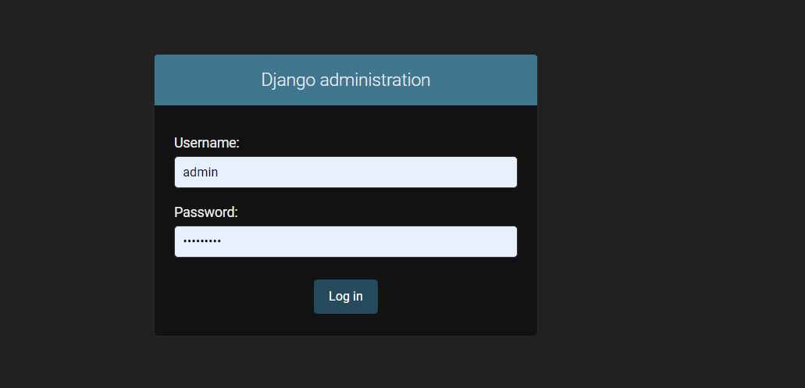
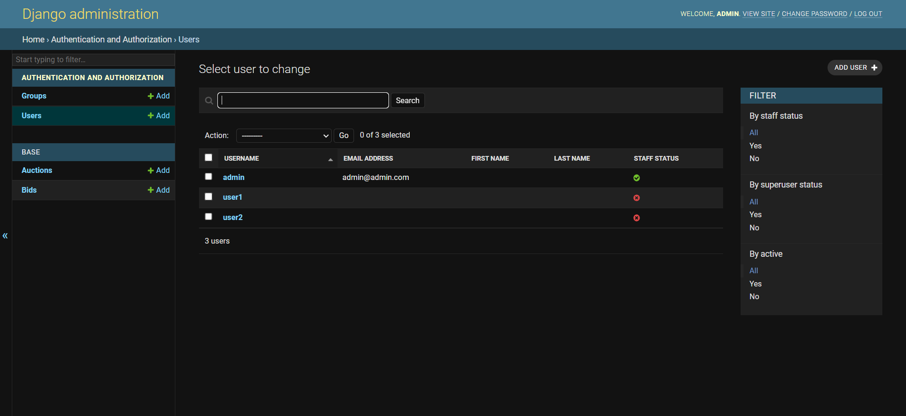
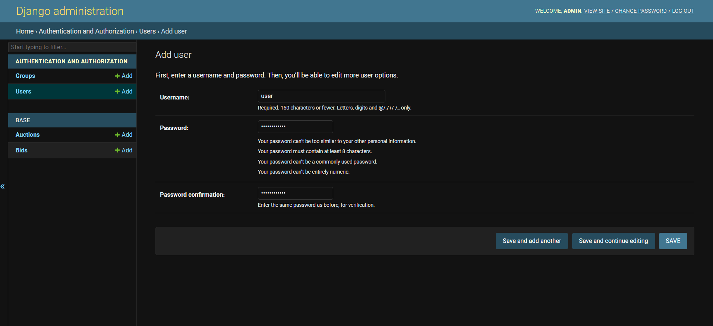

# GameOn-Task
This is a DRF based seller application APIs for the task of GameOn Internship.
<br>
# Enviornment Set-Up
Clone the Repo and create a virtual enviornment as,
 ```sh
  $ virtualenv env
 ```
Start the Virtual Env by activating it.
Once activated, install the requirements by:
 ```sh
  $ pip install -r requirements.txt
 ```
Now inside the directory, execute
 ```sh
  $ python manage.py runserver
 ```
Once the server starts, the project is running.
<br>
# Project Set-Up
<h2> Admin Panel </h2>
Log In to the admin pannel using admin credentials either created by executing,
 ```sh
  $ python manage.py createsuperuser
 ```
Enter the details asked for.
<br>
An Admin/SuperUser is already created, Log-In using
- username: admin
- password: admin1234
<!-- <br>

<br>
<imt src="images/admin-panel.png"> -->
<h3> Creating Users </h3>
Once Logged Into the admin pannel, Create some users by going into the users tab.

<br>

<h3> Creating Auctions </h3>
Similar to creating users, creating auctions.

<br>

<br>
