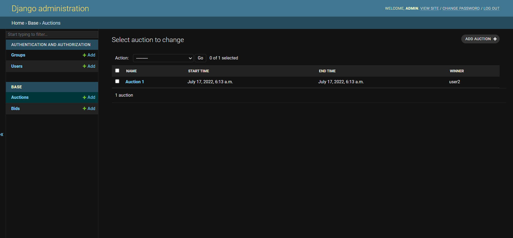
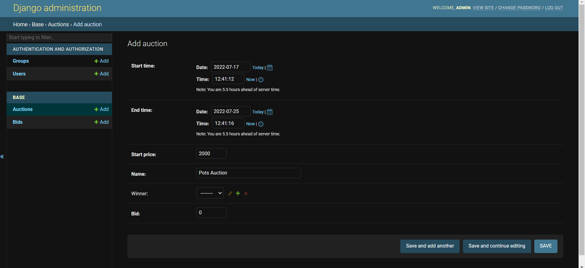
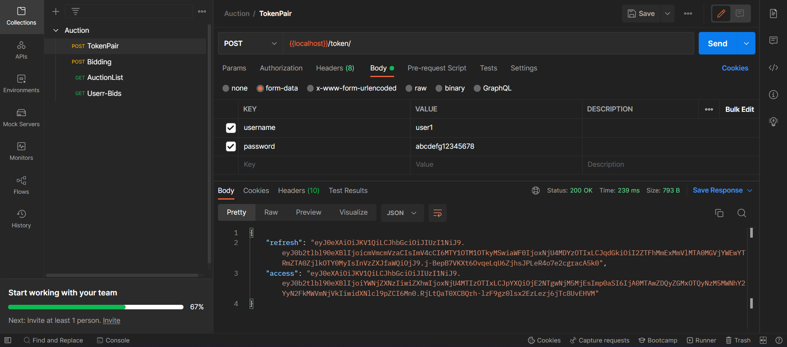
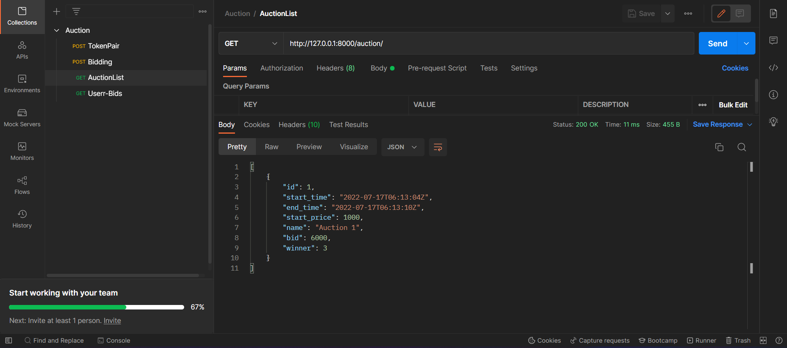
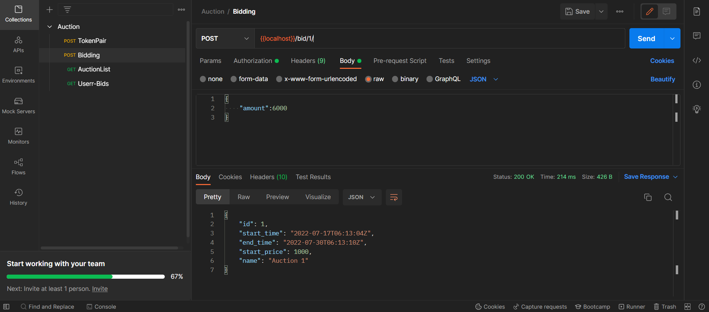
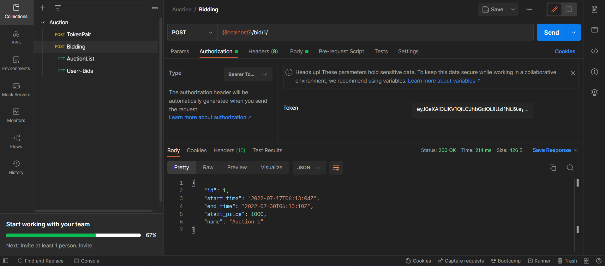
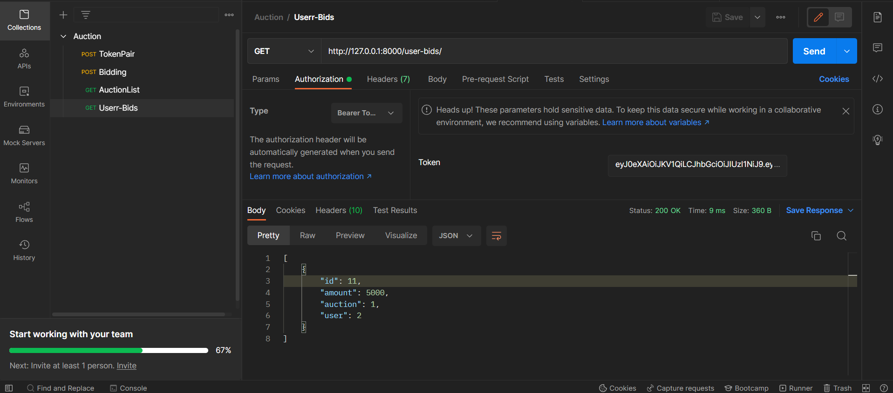

# GameOn-Task
This is a DRF based seller application APIs for the task of GameOn Internship.
<br>
# Enviornment Set-Up
Clone the Repo and create a virtual enviornment as,
 ```sh
  $ virtualenv env
 ```
Start the Virtual Env by activating it.
Once activated, install the requirements by:
 ```sh
  $ pip install -r requirements.txt
 ```
Now inside the directory, execute
 ```sh
  $ python manage.py runserver
 ```
Once the server starts, the project is running.
<br>
# Project Set-Up
Log In to the admin pannel using admin credentials either created by executing
 ```sh
  $ python manage.py createsuperuser
 ```
Enter the details asked for.
<br>
An Admin/SuperUser is already created, Log-In using
- username: admin
- password: admin1234
<br>


## Creating Users
Once Logged Into the admin pannel, Create some users by going into the users tab.
<br><br>

<br><br>

Two Users are already created, user1 and user2. User1 credentials:
- username: user1
- password: abcdefg12345678

## Creating Auctions
Similar to creating users, create auctions.
 - No need to provide <b>Winner</b> and <b>bid</b>.
<br><br>


An Auction is already created named Auction 1 with id=1.

# APIs
Open the PostMan Collection for the APIs. The Server should be running on 8000 port.
## TokenPair
This is for the JWT auth tokens - access and refresh. <br><br>

## Viewing Auctions
Anyone can view the auctions without being authenticated.
The Winners of a auction are only visible once the auction has ended.
Before that, variables of bid and winner are not send in the response.<br><br>

## Bidding
Any authenticated user can Bid. Aucthentication is done by providing the access token in the Headers.
- The Auction id is to be provided in the path/url. <br>
<br>



## Viewing Bids
Any authenticated user can also view their bids. Aucthentication is done by providing the access token in the Headers. <br><br>

